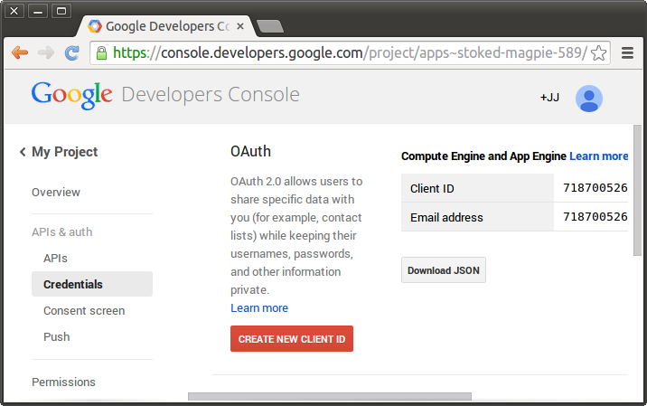
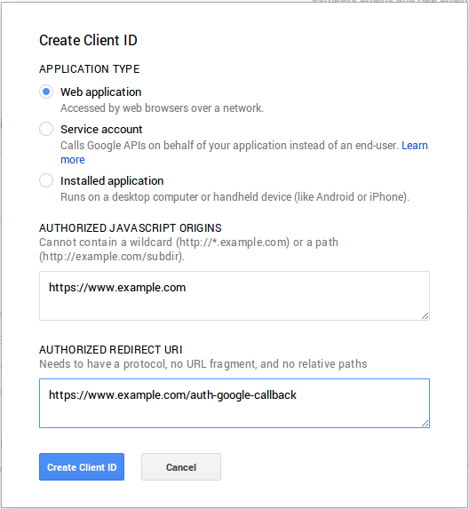

# Authenticating Users

## PAM Authentication

*RStudio Server Professional Edition* authenticates users via the Linux standard PAM (Pluggable Authentication Module) API. PAM is typically configured by default to authenticate against the system user database (`/etc/passwd`) however it can also be configured to authenticate against a wide variety of other systems including ActiveDirectory and LDAP.

The section describes the PAM configuration used for authentication by default after installation. Note that PAM can be used for both authentication as well as to tailor the environment for user sessions (PAM sessions). This section describes only authentication, see the [User Resources and Limits] section for details on how RStudio Server can be configured to use PAM sessions.

### PAM Basics

PAM profiles are are located in the `/etc/pam.d` directory. Each application can have their own profile, and there is also a default profile used for applications without one (the default profile is handled differently depending on which version of Linux you are running).

To learn more about PAM and the many options and modules available for it see the following:

- [http://en.wikipedia.org/wiki/Pluggable_authentication_module](http://en.wikipedia.org/wiki/Pluggable_authentication_module)
- [http://www.centos.org/docs/5/html/Deployment_Guide-en-US/ch-pam.html](http://www.centos.org/docs/5/html/Deployment_Guide-en-US/ch-pam.html)
- [http://tldp.org/HOWTO/User-Authentication-HOWTO/x115.html](http://tldp.org/HOWTO/User-Authentication-HOWTO/x115.html)
- [http://linux.die.net/man/8/pam](http://linux.die.net/man/8/pam)


### Default PAM Configuration

**Debian / Ubuntu**

On Debian and Ubuntu systems RStudio Server does not provide an RStudio specific PAM configuration file. As a result, RStudio Server uses the `/etc/pam.d/other` profile, which by default inherits from a set of common configuration files:

*/etc/pam.d/other*

```css
  @include common-auth
  @include common-account
  @include common-password
  @include common-session
```

If the `/etc/pam.d/other` profile reflects the authentication system and policies that you'd like RStudio Server to use then no further configuration is required. If you want to create a custom PAM profile for RStudio you would create a file named `/etc/pam.d/rstudio` and specify whatever settings are appropriate. 

**RedHat / CentOS / SUSE**

On RedHat, CentOS and SUSE systems applications without their own PAM profiles are denied access by default. Therefore to ensure that RStudio is running and available after installation a default PAM profile is installed at `/etc/pam.d/rstudio`. This profile is configured to require a user-id greater than 500 and to authenticate users against local system accounts:

*/etc/pam.d/rstudio*

```bash
auth      requisite      pam_succeed_if.so uid >= 500 quiet
auth      required       pam_unix.so nodelay
account   required       pam_unix.so
```

This default PAM profile may not reflect the authentication behavior that you want for RStudio Server. In that case, some customization may be required. If you've already set up another PAM profile (e.g. `/etc/pam.d/login`) with the desired behavior then it may be enough to simply copy that profile over the RStudio one. For example:

```bash
$ sudo cp /etc/pam.d/login /etc/pam.d/rstudio
```

### Diagnosing PAM Authentication Problems

If you are unable to login to RStudio Server there may be an underlying problem with the PAM configuration. The best way to diagnose PAM configuration problems is to use the `pamtester` utility (which is bundled with RStudio Server). Using `pamtester` enables you to test authentication in an isolated environment as well as to see much more detailed diagnostics.

The `pamtester` utility is located at `/usr/lib/rstudio-server/bin/pamtester`. To invoke it you pass several arguments indicating the PAM profile to test, the user to test for, and whether you want verbose output. For example:

```bash
sudo /usr/lib/rstudio-server/bin/pamtester --verbose rstudio <username> authenticate
```

You can find more detailed documentation on using `pamtester` here: [http://linux.die.net/man/1/pamtester](http://linux.die.net/man/1/pamtester).

### Managing PAM Login Lifetimes

When logging in using PAM authentication users have an option to stay signed in across browser sessions. By default when choosing the stay signed in option users will remain signed in for 30 days. You can modify this behavior using the `auth-stay-signed-in-days` setting. For example:

*/etc/rstudio/rserver.conf*

```ini
auth-stay-signed-in-days=7
```

You can entirely prevent this option from being shown by using the `auth-stay-signed-in` setting. For example:

*/etc/rstudio/rserver.conf*

```ini
auth-stay-signed-in=0
```

Setting this option to `0` will result in users being prompted to log in each time they start a new browser session (i.e. logins will only be valid as long as the browser process in which they originated in remains running).

## Restricting Access to Specific Users

### Minimum User Id

By default RStudio Server only allows normal (as opposed to system) users to successfully authenticate. The minimum user id is determined by reading the `UID_MIN` value from the `/etc/login.defs` file. If the file doesn't exist or `UID_MIN` isn't defined within it then a default value of 1000 is used.

You change the minimum user id by specifying the `auth-minimum-user-id` option. For example:

*/etc/rstudio/rserver.conf*

```ini
auth-minimum-user-id=100
```

Note that it's possible that your PAM configuration is also applying a constraint on user-ids (see the [Default PAM Configuration] section above for an example). In this case you should ensure that the `auth-minimum-user-id` is consistent with the value specified in your PAM configuration.

### Restricting by Group

You can specify that only users of certain groups are allowed to access RStudio Server. To do this you use the `auth-required-user-group` setting. For example:

*/etc/rstudio/rserver.conf*

```ini
auth-required-user-group=rstudio-users
```

You can specify a single group as the above example does or a comma-delimited list of groups. For example:

*/etc/rstudio/rserver.conf*

```ini
auth-required-user-group=analysts,admins,rstudio-users
```

Note that this change will not take effect until the server is restarted. 

#### Creating and Managing Group Membership

To create a new group you use the `groupadd` command:

```bash
$ sudo groupadd <groupname>
```

To add a user to an existing group you use the `usermod` command:

```bash
$ sudo usermod -a -G <groupname> <username>
```

Note that it's critical that you include the `-a` flag as that indicates that the group should be added to the user rather than replace the user's group list in it's entirety.

## Google Accounts

RStudio Server can be configured to authenticate users via Google Accounts. This enables users to login with their existing Gmail or Google Apps credentials and to be automatically authenticated to RStudio Server whenever they are already logged into their Google account.

### Registering with Google

In order to use Google Accounts with RStudio Server you need to register your server with Google for OAuth 2.0 Authentication. You do this by creating a new "Project" for your server in the *Google Developer Console*:

<https://console.developers.google.com/>

Once you've created a project you go to the *Credentials* area of *APIs and auth* and choose to **Create New Client ID**:




You'll then be presented with a dialog used to create a new client ID:



You should select "Web application" as the application type and provide two URLs that correspond to the server you are deploying on. The screenshot above uses `https://www.example.com` as the host, you should substitute your own domain and port (if not using a standard one like 80 or 443) in your configuration.

This will result in two values which you'll need to provide as part of the RStudio Server configuration: `client-id` and `client-secret` (they'll be displayed in the *Google Developer Console* after you complete the dialog).

### Enabling Google Accounts

To enable authentication with Google Accounts you add the `auth-google-accounts` option to the RStudio Server configuration file:

*/etc/rstudio/rserver.conf*

```ini
auth-google-accounts=1
```

In addition, you need to add a configuration file (`/etc/rstudio/google-client-secret`) containing the `client-id` and `client-secret` that you received when registering your site with Google. For example, the configuration file might look like this:

*/etc/rstudio/google-client-secret*

```ini
client-id=lllllllllllll-xxxxxxxxxxxxxxxxxxxxxx.apps.googleusercontent.com
client-secret=BhCC6rK7Sj2ZtPH0ord7lO1w
```

The `/etc/rstudio/google-client-secret` file should have user read/write file permissions (i.e. 0600) to protect it's contents from other users. You can ensure this as follows:

```bash
$ sudo chmod 0600 /etc/rstudio/google-client-secret
```

Note that the above `client-id` and `client-secret` aren't the actual values you'll use. Rather, you should substitute the values that you obtained from Google when registering your site for OAuth authentication.

Once you enable authentication with Google Accounts that becomes the exclusive means of authentication (you can't concurrently use both PAM and Google Account authentication).

### Translating to Local Accounts

#### Creating Matching Accounts

Once a user is authenticated via Google Accounts it's necessary to map their Google Accounts identity to a local system account. The default and most straightforward way to do this is to create a local account with a username identical to their Google email address.

If you choose to create local accounts that match Google email addresses be sure to use only lowercase characters in the account name, since Google email addresses are transformed to lower-case prior to matching them to local account names.

One problem with creating local accounts that match Google email addresses is that they often contain characters that are invalid by default within Linux usernames (e.g. @ or .). On Debian/Ubuntu systems it's possible to force the system to create a user with these characters. Here's an example of creating a user with a username that contains typically invalid characters:

```bash
$ sudo adduser --force-badname <username>
```

Note that the `--force-badname` option is only available on Debian/Ubuntu systems and is not available on RedHat/CentOS or SLES systems.

If the users you are creating will only be accessing the server via RStudio, you may also want to disable their ability to login as a normal interactive user and to specify that they have no password. For example:

```bash
$ sudo adduser --force-badname --disabled-login --disabled-password <username>
```

#### Using an Account Mappings File

Alternatively, you map create local accounts that do not match Google email addresses and then specify a mapping of Google accounts to local accounts via the `/etc/rstudio/google-accounts` configuration file. For example:

*/etc/rstudio/google-accounts*

```ini
john.smith@gmail.com=jsmith
sally.jones@gmail.com=sjones
```

Note that changes to the `google-accounts` configuration file take effect immediately and do not require a server restart.

## Proxied Authentication

You can configure RStudio Server to participate in an existing web-based single-sign-on authentication scheme using proxied authentication. In this configuration all traffic to RStudio Server is handled by a proxy server which also handles user authentication. 

In this configuration the proxy server adds a special HTTP header to requests to RStudio Server letting it know which authenticated user is making the request. RStudio Server trusts this header, launching and directing traffic to an R session owned by the specified user.

### Enabling Proxied Authentication

To enable proxied authentication you need to specify both the `auth-proxy` and `auth-proxy-sign-in-url` settings (the sign-in URL is the  absolute URL to the page that users should be redirected to for sign-in). For example:

*/etc/rstudio/rserver.conf*

```ini
auth-proxy=1
auth-proxy-sign-in-url=http://example.com/sign-in
```

Note that changes to the configuration will not take effect until the server is restarted.

### Implementing the Proxy

#### Sign In URL

The sign in URL should host a page where the user specifies their credentials (this might be for example the main page for an existing web-based authentication system). After collecting and authorizing the credentials the sign in URL should then redirect back to the URL hosting the RStudio Server.

RStudio will redirect to the sign in URL under the following conditions:

1. Whenever an HTTP request that lacks the username header is received by the server; and

2. When the user clicks the "Sign out" button in the RStudio IDE user interface.

You should be sure in setting up the proxy server that traffic bound for the sign-in URL is excluded from forwarding to RStudio Server (otherwise it will end up in an infinite redirect loop).

#### Forwarding the Username

When proxying pre-authenticated traffic to RStudio Server you need to include a special HTTP header (by default `X-RStudio-Username`) with each request indicating which user the request is associated with. For example:

```ini
X-RStudio-Username: jsmith
```

It's also possible to specify both a system username and a display username (in the case where system accounts are dynamically provisioned and don't convey actual user identity). For example:

```ini
X-RStudio-Username: rsuser24/jsmith
```

Note that is highly recommended that you *do not use* the default `X-RStudio-Username` header name. The reasons for this are described in the section on security considerations immediately below.

#### Rewriting Usernames

It may be that the proxy system you are using sends the username in a format that doesn't match that of users on the system, however can be easily transformed to one that does (e.g. it has a standard prefix before the username). If this is the case you can specify the `auth-proxy-user-header-rewrite` option to provide a re-write rule for the inbound header. For example, the following rule strips the prefix "UID-" from a username header:

```markdown
auth-proxy-user-header-rewrite=^UID-([a-z]+)$ $1
```

The format of a re-write rule is a regular expression followed by a space and then a replacement string. The replacement string can reference captured parts of the regular expression using `$1`, `$2`, etc.

### Security Considerations

#### Keeping the Header Name Secret

Using the the default header name `X-RStudio-Username` creates a security problem: code running behind the proxy (i.e. code within R sessions) could form requests back to the server which impersonate other users (by simply inserting the header in their request).

To prevent this issue you can specify a custom header name which is kept secret from end users. This is done by creating a special configuration file (`/etc/rstudio/secure-proxy-user-header`) that contains the name of the header, and then setting it's file permissions so that it's not readable by normal users. For example:

```bash
sudo sh -c "echo 'X-Secret-User-Header' > /etc/rstudio/secure-proxy-user-header"
sudo chmod 0600 /etc/rstudio/secure-proxy-user-header
```

#### Preventing Remote Use of the Header

When implementing the proxy it's important to remember that RStudio Server will always trust the username header to authenticate users. It's therefore critical from the standpoint of security that all requests originating from the proxy have this header set explicitly by the proxy (as opposed to allowing the header to be specified by a remote client).

### Troubleshooting with Access Logs

If you want to see exactly which requests RStudio Server is receiving and whether they include the expected username information, you can temporarily enable server access logs using the `server-access-logs` setting as follows:

**/etc/rstudio/rserver.conf**

```ini
server-access-logs=1
```

After restarting RStudio Server the following file will contain a record of each HTTP request made to the server along with it's HTTP response code:

```bash
/var/log/rstudio-server/rserver-http-access.log
```

The log file will contain entries that look like this:

```
127.0.0.1 - - [29/Jun/2015:06:30:41 -0400] "GET /s/f01ddf8222bea98a/ HTTP/1.1"
200 91 "http://localhost:8787/s/f01ddf8222bea98a/" "Mozilla/5.0 (X11; Linux x86_64)
AppleWebKit/537.36 (KHTML, like Gecko) Chrome/43.0.2357.125 Safari/537.36" "jsmith"
```

Note that the very last item in the log file entry is `"jsmith"`. This is the username that RStudio Server read from the header passed by the proxy server. If this shows up as blank (`"-"`) then your proxy server isn't forwarding the header or using the correct header name in forwarding.

**Important Note**: Once you've concluded troubleshooting it's important that you remove the `server-access-logs=1` option from the `/etc/rstudio/rserver.conf` file (since this log file is not rotated it will eventually consume a large amount of disk space if you don't remove the option).


