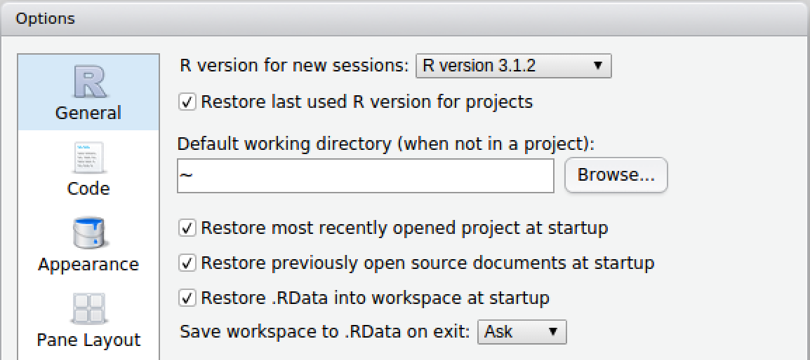
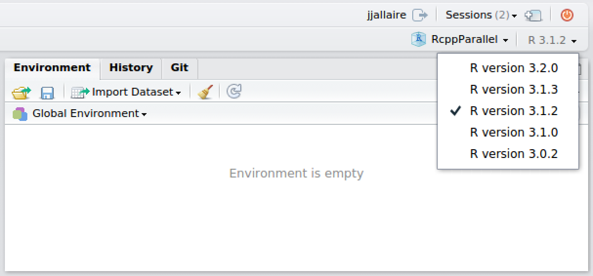

# R Versions

## Overview

RStudio Server enables users and administrators to have very fine grained control over which versions of R are used in various contexts. Capabilities include:

1. Administrators can install several versions of R and specify a global default version as well as per-user or per-group default versions.

2. Users can switch between any of the available versions of R as they like.

3. Users can specify that individual R projects remember their last version of R and always use that version until explicitly migrated to a new version.

Flexible control over R versions make it much easier to provide upgraded versions of R for users (or individual projects) that require them; while at the same time not disrupting work that requires continued use of older versions.

## Installing Multiple Versions of R

### Binary and Source Versions

Versions of R can be obtained by various means, the most common of which is installing a binary version from a standard apt-get (Debian/Ubuntu) or yum (RHEL) repository. Versions installed this way are nearly always located in the `/usr/lib/R` directory.

You may also have obtained a binary version of R from a vendor like Oracle, Revolution Analytics, or TIBCO. In those cases please consult the vendor's documentation to determine the location where R is installed and update the `/etc/rstudio/r-versions` file to point to it as described in [Determining Available Versions].

To install additional versions of open-source R side-by-side with a version obtained from an apt-get or yum repository you will typically need to build R from source. The next section provides further details and recommendations on building from source.

### Building Additional Versions from Source

#### Installing Dependencies

Installing additional versions of R side-by-side with the system version requires building R from source but is very straightforward. First, ensure that you have the build dependencies required for R. On RedHat/CentOS you'd use this command:

```bash
$ sudo yum-builddep R
```

On Debian/Ubuntu systems you'd use this command:

```bash
$ sudo apt-get build-dep r-base
```

#### Configuring and Building R

Once you've satisfied the build dependencies, you should obtain and unarchive the source tarball for the version of R you want to install. Then from within the extracted source directory execute these commands (this example assumes you are installing R 3.2.0):

```bash
$ ./configure --prefix=/opt/R/3.2.0 --enable-R-shlib
$ make
$ sudo make install
```

Note that the `--enable-R-shlib` option is required in order to make the underlying R shared library available to RStudio Server.

#### Using the System BLAS Libraries

You may also wish to link to the system BLAS libraries rather than use the R internal versions. For this you'd use the following configure command:

```bash
./configure --prefix=/opt/R/3.1.0 --enable-R-shlib --with-blas --with-lapack
```

### Recommended Installation Directories

RStudio Server automatically scans for versions of R at the following locations:

```bash
/usr/lib/R
/usr/lib64/R
/usr/local/lib/R
/usr/local/lib64/R
/opt/local/lib/R
/opt/local/lib64/R
```

In addition, RStudio Server scans all subdirectories of the following directories within `/opt`:

```bash
/opt/R
/opt/local/R
```

For example, any of the following installed versions of R will be automatically detected by RStudio Server:

```bash
/opt/R/3.1.0
/opt/R/3.2.0
/opt/local/R/3.1.0
/opt/local/R/3.2.0
```

If you have versions of R located at other places in the file system RStudio Server can still utilize them however you'll need to explicitly specify their location in a configuration file (this is covered in more detail in the [Using Multiple Versions] section).

## Configuring the Default Version of R

When multiple versions of R are installed you will need to specify which version is the default one for new R sessions. This can be done automatically via the system PATH however several other mechanisms are provided when more flexibility is required.

### Single Default Version of R

RStudio Server uses the version of R pointed to by the output of the following command:

```bash
$ which R
```

The `which` command performs a search for the R executable using the system PATH. RStudio will therefore by default bind to the same version that is run when R is executed from a terminal.

For versions of R installed by system package managers this will be `/usr/lib/R`. For versions of R installed from source this will typically (but not always) be `/usr/local/lib/R`.

If you want to override which version of R is used then you can use the `rsession-which-r` setting. For example:

*/etc/rstudio/rserver.conf*

```ini
rsession-which-r=/usr/local/lib/R
```

Note that this change will not take effect until the server is restarted. 

### Default Version Per User or Group

You can use the [User and Group Profiles] feature to specify distinct default versions of R for various users and groups. For example, the following profile configuration uses R 3.1.0 as the system default, R 3.2.0 for the `powerusers` group, and R 3.0.2 for the user `jsmith`:

```ini
[*]
r-version = /opt/R/3.1.0

[@powerusers]
r-version = /opt/R/3.2.0

[jsmith]
r-version = /opt/R/3.0.2
```

Note that `r-version` specifies the full path to the directory where R is installed.

### User Configurable Default Version

Users can also configure their own default version of R. This is done using the **General** pane of the **Global Options** dialog:



See the [Disabling Use of Multiple Versions] section for details on how to disable version switching entirely either system-wide or on a per-user or per-group basis.

## Using Multiple Versions of R Concurrently

### Determining Available Versions

RStudio Server scans for and automatically discovers versions of R in the following locations:

```bash
/usr/lib/R
/usr/lib64/R
/usr/local/lib/R
/usr/local/lib64/R
/opt/local/lib/R
/opt/local/lib64/R
/opt/R/*
/opt/local/R/*
```

This is described in more detail in the [Recommended Installation Directories] section. If you have installed versions of R in alternate locations you can list them within the `/etc/rstudio/r-versions` configuration file (note that this file is not created by default so you'll need to create it if doesn't already exist). For example:

*/etc/rstudio/r-versions*

```ini
/opt/R-3.2.1
/opt/R-devel-3.3
```


In addition, any version of R referenced in an `r-version` directive within [User and Group Profiles] is also recognized.

#### Excluding Versions

If you have versions of R on your system that would normally be picked up by automatic scanning but which you'd like to exclude, the most straightforward thing to do is to disable R version scanning altogether and explicitly specify all versions you'd like to use in `/etc/rstudio/r-versions`. For example:

*/etc/rstudio/rserver.conf*

```ini
r-versions-scan=0
```

### Switching Between Versions

To switch between versions of R you use the version menu near the top right of the IDE:



After switching, the specified version will be used for the duration of the current session (see the section on [Multiple R Sessions] for more details on the lifetime of sessions). Newly created R sessions will continue to use whatever default R version has been configured for the user.

#### Preserving Versions for Projects

It's often useful to preserve the version used within an R project irrespective of whatever the current default R version is for a user. This is in fact the behavior by default for RStudio projects however can be changed from the the **General** pane of the **Global Options** dialog.

This configuration enables users to easily migrate projects one-by-one to a new version of R after it's been confirmed that all the code continues to work as expected under the new version.

### Disabling Use of Multiple Versions

If you want to prevent users from being able to change R versions entirely you can use the `r-versions-multiple` option:

**/etc/rstudio/rserver.conf**

```ini
r-versions-multiple=0
```

You can also configure this on a per-user or per-group basis by specifying the `r-versions-multiple` option within [User and Group Profiles].

## Managing Upgrades of R

There are various ways to handle upgrades to new versions of R ranging from allowing each user to control exactly when they upgrade all the way to forcing everyone to upgrade all at once. 

By combining the various options described above you can create a highly customized upgrade policy that reflects both your internal policies and the preferences of your users.

### User Controlled Migration

The most conservative approach is to start with a default version of R and preserve that default for the lifetime of the server. In this configuration you can continue to install new versions of R as they are released however users won't ever run those new versions unless they make an explicit gesture to do so. See the [User Configurable Default Version] and [Switching Between Versions] sections for details on how users can explicitly switch versions.

### Partial Migration

If your posture towards new R versions is that you'd like users to migrate to the new version(s) as quickly as is convenient you can be more aggressive in how you introduce them. In this scenario you might use the [Default Version Per User or Group] feature to migrate a portion of new users immediately but preserve older versions for those who request it.

Note that in this scenario R projects will still preserve their previous R version so long as users have enabled the option described in [Preserving Versions for Projects].

### Full Migration

The most aggressive approach is to force all users to upgrade to the new R version immediately (this is essentially what happens in the open-source version of RStudio Server). To implement this you'd set a [Single Default Version of R] as well as disabling the use multiple versions as described in [Disabling Use of Multiple Versions].

Note that via [User and Group Profiles] you could also have a subset of R users that are always fully migrated to new versions while preserving user controlled migration or partial migration for others.  


